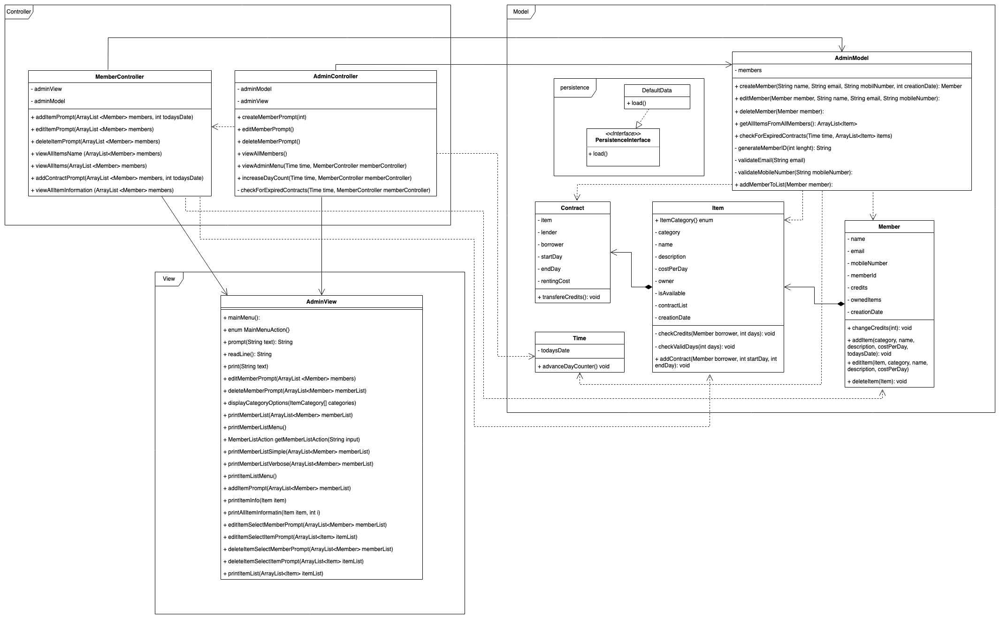

# The Stuff Lending System OO-Design
This document describes the design according to the requirements presented in assignment 2.

## Architectural Overview
The application uses the model-view-controller (MVC) architectural pattern. The view is passive and gets called from the controller. The view may only read information from the model, not directly change it.

## Detailed Design
### Class Diagram
A class diagram that shows the final application - focus on classes/packages and relations (association, dependency, generalization, realization), add only some key attributes and operations. 

### Sequence Diagram
A sequence diagram that corresponds to a scenario where a new third member is added to the system where there already exist two other members. It should involve objects with types from the model, view and controller.

### Object Diagram
An object diagram that corresponds to the sequence diagram scenario.
